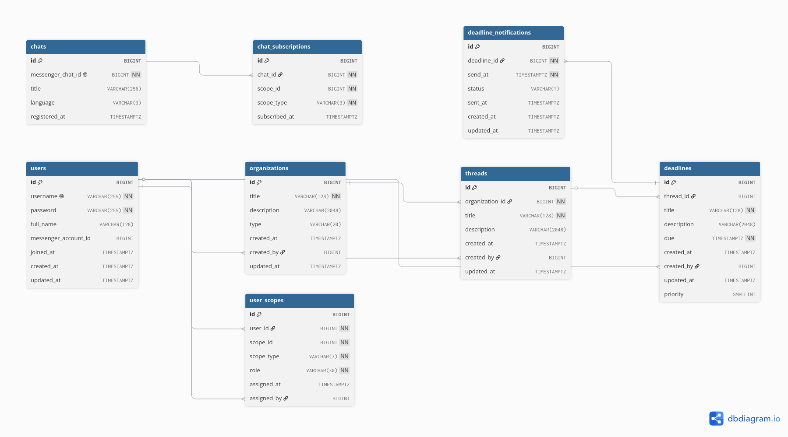

# Групповой проект

Работу выполнили:

- Астафьев Никита БПИ242
- Беднова Александра БПИ249
- Лещук Глеб БПИ249
- Лушенков Эдвард БПИ242
- Часовских Никита БПИ242

## 1.1. Описание предметной области

### Кому нужна разрабатываемая программа или система:

Система необходима студентам, учебным группам, фрилансерам, проектным командам и небольшим организациям, которым требуется централизованно отслеживать сроки выполнения задач, контролировать прогресс и своевременно получать автоматические напоминания о наступающих дедлайнах.

### Кто и как будет ее использовать:

1. Обычные пользователи (студенты, исполнители): регистрируются в системе, создают личные дедлайны или принимают назначенные задачи, настраивают удобные интервалы напоминаний и получают уведомления в Telegram.
2. Администраторы и руководители команд (тимлиды, старосты): создают организации и разделы (потоки), приглашают участников, распределяют роли, назначают исполнителей на конкретные дедлайны и подключают общие рабочие чаты для получения командных уведомлений.

Системные компоненты (фоновые воркеры и боты): автоматически генерируют очередь уведомлений на основе сроков дедлайнов, отправляют сообщения через Telegram API, обрабатывают статусы доставки и обновляют статусы задач при получении подтверждения.

### Какие пользовательские сценарии являются ключевыми:

1. Сценарий личного трекинга: студент создает личное пространство, добавляет дедлайны по учебным предметам с указанием срока, настраивает систему так, чтобы получать напоминания за день, за час и в момент наступления срока.
2. Сценарий командного управления: тимлид создает организацию проекта, разбивает его на потоки (например, спринты или этапы), назначает участников, создает дедлайны и распределяет исполнителей. Затем он привязывает Telegram-чат команды к организации, чтобы все участники получали уведомления о новых задачах и приближающихся сроках в общий чат.
3. Сценарий обработки уведомлений: пользователь получает напоминание в Telegram, переходит по ссылке или использует команды бота для отметки задачи как выполненной, что является сигналом перестать отправлять дальнейшие уведомления, даже если срок исполнения не был достигнут.

## 1.2 Функциональные требования

### Какие функции должна поддерживать система:

- Управление иерархической структурой данных: создание и администрирование организаций, потоков (разделов) и дедлайнов.
- Управление пользователями и правами доступа: регистрация, аутентификация, назначение ролей на разных уровнях (владелец, администратор, участник организации или потока, исполнитель дедлайна) через механизм скоупов.
- Управление дедлайнами: создание задач с указанием сроков, описаний, назначение исполнителей, отслеживание статусов.
  Интеграция с мессенджерами: привязка Telegram-чатов к системе, управление подписками чатов на уведомления по конкретным организациям, потокам или отдельным дедлайнам.
- Движок уведомлений: автоматическое планирование отправки напоминаний, поддержка различных типов уведомлений.

Какие операции над данными должны выполняться:

- Агрегация и фильтрация дедлайнов по организациям, потокам, статусам и срокам исполнения.
- Проверка прав доступа пользователя к конкретному скоупу (организации, потоку или дедлайну) на основе полиморфных связей и назначенных ролей.

Какие сценарии чтения, изменения, добавления и удаления данных являются обязательными:

- Добавление (Create):
    - Создание пользователя, организации, потока, дедлайна;
    - Добавление исполнителя к дедлайну;
    - Привязка Telegram-чата и создание подписки чата на скоуп;
    - Генерация записей уведомлений.
- Чтение (Read):
    - Получение списка дедлайнов пользователя;
    - Получение списка дедлайнов организации;
    - Выборка из базы данных уведомлений, ожидающих отправки (статус Pending);
    - Получение списка активных чатов, подписанных на конкретный скоуп.
- Изменение (Update):
    - Редактирование метаданных дедлайна (срок, приоритет, описание);
    - Изменение роли пользователя в скоупе;
    - Обновление статуса уведомления после отправки (Sent, Failed, Ignored);.
- Удаление (Delete);
    - Каскадное физическое удаление уведомлений, назначений и подписок при удалении родительского дедлайна, потока или организации.

## 1.4 Предварительная схема БД



### Пользователь (`users`)

Хранит учетные записи пользователей.

**Атрибуты**:

- `id` — уникальный идентификатор
- `username` — уникальное имя пользователя для входа (NOT NULL)
- `password` — хэш пароля (NOT NULL)
- `full_name` — полное имя для отображения
- `messenger_account_id` — связывает с Telegram-пользователем
- `joined_at` — дата регистрации (по умолчанию CURRENT_TIMESTAMP)
- `created_at`, `updated_at` — служебные даты

**Индексы**: по `username`, по `messenger_account_id`

**Связи**: создает организации (`organizations.created_by`), создает разделы (`threads.created_by`), создает дедлайны (`deadlines.created_by`), владеет правами (`user_scopes.user_id`), назначает права (`user_scopes.assigned_by`)

### Организация (`organizations`)

Верхнеуровневый контейнер, объединяющий разделы и дедлайны.

**Атрибуты**:

- `id` — уникальный идентификатор
- `title` — название (NOT NULL)
- `description` — описание (до 2048 символов)
- `type` — тип: `PUBLIC`, `PRIVATE` (по умолчанию), `PERSONAL`
- `created_at`, `updated_at` — служебные даты
- `created_by` — пользователь-создатель

**Индексы**: по `type`, по `created_by`

**Связи**: создана пользователем (`users`), содержит разделы (`threads`)

### Раздел (`threads`)

Группирует дедлайны внутри организации по тематикам или проектам.

**Атрибуты**:

- `id` — уникальный идентификатор
- `organization_id` — идентификатор организации-владельца (NOT NULL)
- `title` — название (NOT NULL)
- `description` — описание (до 2048 символов)
- `created_at`, `updated_at` — служебные даты
- `created_by` — пользователь-создатель

**Индексы**: по `organization_id`, по `created_by`

**Связи**: принадлежит организации (`organizations`), создан пользователем (`users`), содержит дедлайны (`deadlines`)

### Дедлайн (`deadlines`)

Основная сущность — задача с установленным сроком выполнения.

**Атрибуты**:

- `id` — уникальный идентификатор
- `thread_id` — идентификатор раздела-владельца
- `title` — название (NOT NULL)
- `description` — описание (до 2048 символов)
- `due` — срок выполнения (NOT NULL)
- `priority` — приоритет от 1 до 5 (по умолчанию 1)
- `created_at`, `updated_at` — служебные даты
- `created_by` — пользователь-создатель

**Индексы**: по `thread_id`, по `due`, по `created_by`

**Связи**: принадлежит разделу (`threads`), создан пользователем (`users`), имеет уведомления (`deadline_notifications`)

### Чат (`chats`)

Хранит информацию о Telegram-чатах для отправки уведомлений.

**Атрибуты**:

- `id` — уникальный идентификатор
- `messenger_chat_id` — идентификатор чата в Telegram (уникальный, NOT NULL)
- `title` — название чата
- `language` — язык уведомлений: `RU` или `EN` (по умолчанию `EN`)
- `registered_at` — дата регистрации чата в системе

**Индексы**: по `messenger_chat_id`

**Связи**: имеет подписки (`chat_subscriptions`)

### Подписка чата (`chat_subscriptions`)

Определяет, на какие объекты подписан чат для получения уведомлений.

**Атрибуты**:

- `id` — уникальный идентификатор
- `chat_id` — идентификатор чата (NOT NULL)
- `scope_id` — идентификатор объекта подписки (NOT NULL)
- `scope_type` — тип объекта: `ORG` (организация), `THR` (раздел), `DDL` (дедлайн) (NOT NULL)
- `subscribed_at` — дата подписки

**Ограничения**: уникальность по `(chat_id, scope_id, scope_type)`

**Индексы**: по `chat_id`, по `(scope_id, scope_type)`

**Связи**: принадлежит чату (`chats`)

### Уведомление дедлайна (`deadline_notifications`)

Планирует и отслеживает отправку уведомлений.

**Атрибуты**:

- `id` — уникальный идентификатор
- `deadline_id` — идентификатор дедлайна (NOT NULL)
- `send_at` — время отправки (NOT NULL)
- `status` — статус: `P` (ожидает), `S` (отправлено), `F` (ошибка), `I` (игнорировано) (по умолчанию `P`)
- `sent_at` — фактическое время отправки
- `created_at`, `updated_at` — служебные даты

**Индексы**: по `deadline_id`, по `send_at`, по `status`, по `(send_at, status)` для поиска ожидающих

**Связи**: принадлежит дедлайну (`deadlines`)

### Права доступа пользователя (`user_scopes`)

Управляет ролями пользователей на объектах системы.

**Атрибуты**:

- `id` — уникальный идентификатор
- `user_id` — идентификатор пользователя (NOT NULL)
- `scope_id` — идентификатор объекта (NOT NULL)
- `scope_type` — тип объекта: `ORG`, `THR`, `DDL` (NOT NULL)
- `role` — роль (NOT NULL):
    - на уровне организации: `ORG_MEMBER`, `ORG_ADMIN`, `ORG_OWNER`
    - на уровне раздела: `THR_ASSIGNEE`, `THR_ADMIN`, `THR_OWNER`
    - на уровне дедлайна: `DDL_ASSIGNEE`
- `assigned_at` — дата назначения прав
- `assigned_by` — пользователь, назначивший права

**Ограничения**: уникальность по `(user_id, scope_id, scope_type)`

**Индексы**: по `user_id`, по `(scope_id, scope_type)`, по `role`

**Связи**: принадлежит пользователю (`users`), назначен пользователем (`users`)

### Связи

| Связь                                       | Тип | Внешний ключ                         | Каскад     |
| ------------------------------------------- | --- | ------------------------------------ | ---------- |
| Пользователь -> Организация                 | 1:N | `organizations.created_by`           | `SET NULL` |
| Пользователь -> Раздел                      | 1:N | `threads.created_by`                 | `SET NULL` |
| Пользователь -> Дедлайн                     | 1:N | `deadlines.created_by`               | `SET NULL` |
| Пользователь -> Права доступа               | 1:N | `user_scopes.user_id`                | `CASCADE`  |
| Пользователь -> Права доступа (назначивший) | 1:N | `user_scopes.assigned_by`            | `SET NULL` |
| Организация -> Раздел                       | 1:N | `threads.organization_id`            | `CASCADE`  |
| Раздел -> Дедлайн                           | 1:N | `deadlines.thread_id`                | `CASCADE`  |
| Дедлайн -> Уведомление                      | 1:N | `deadline_notifications.deadline_id` | `CASCADE`  |
| Чат -> Подписка                             | 1:N | `chat_subscriptions.chat_id`         | `CASCADE`  |

### Полиморфные связи

Две сущности используют полиморфизм через пару полей `(scope_id, scope_type)`:

1. **Подписки чатов** (`chat_subscriptions`) — чат подписывается на события объектов разных типов
2. **Права доступа** (`user_scopes`) — пользователю назначаются роли на объектах разных типов

## 1.5. Текстовые ограничения на данные

### Пользователи (users)

- Каждый пользователь имеет ровно один уникальный `username`
- `username` и `password` обязательны для заполнения
- Язык интерфейса (`language`) принимает только значения `'RU'` или `'EN'`
- Роль пользователя (`role`) принимает только значения `'USER'` или `'ADMIN'`
- Один пользователь может быть связан с 0 или 1 аккаунтом Telegram (`messenger_account_id`)
- Один пользователь может создать 0 или более организаций
- Один пользователь может создать 0 или более разделов
- Один пользователь может создать 0 или более дедлайнов
- Один пользователь может иметь 0 или более записей о правах доступа (`user_scopes`)
- Один пользователь может быть назначен исполнителем на 0 или более дедлайнов

---

### Организации (organizations)

- Каждая организация имеет ровно один уникальный идентификатор `id`
- `title` организации обязателен для заполнения
- Тип организации (`type`) принимает только значения `'PUBLIC'`, `'PRIVATE'` или `'PERSONAL'`
- Каждая организация создана ровно одним пользователем (`created_by`) — при удалении пользователя поле обнуляется
- Одна организация содержит 0 или более разделов (`threads`)
- Одна организация содержит 0 или более дедлайнов (`deadlines`) напрямую (без привязки к разделу)
- Удаление организации каскадно удаляет все её разделы и дедлайны

---

### Разделы (threads)

- Каждый раздел принадлежит ровно одной организации (`organization_id`, NOT NULL)
- `title` раздела обязателен для заполнения
- Каждый раздел создан ровно одним пользователем (`created_by`) — при удалении пользователя поле обнуляется
- Один раздел содержит 0 или более дедлайнов
- Удаление организации каскадно удаляет все её разделы
- Удаление раздела **не** удаляет связанные дедлайны — поле `thread_id` у них обнуляется (`ON DELETE SET NULL`)
- `sort_order` определяет порядок отображения раздела внутри организации; допускаются одинаковые значения у разных разделов одной организации

---

### Дедлайны (deadlines)

- Каждый дедлайн принадлежит ровно одной организации (`organization_id`, NOT NULL)
- Каждый дедлайн принадлежит 0 или 1 разделу (`thread_id`): дедлайн может существовать без раздела
- Если раздел, которому принадлежит дедлайн, удалён, `thread_id` обнуляется, сам дедлайн **не** удаляется
- `title` и `due` обязательны для заполнения
- Статус дедлайна (`status`) принимает только значения `'NOT_STARTED'`, `'IN_PROGRESS'` или `'FINISHED'`
- Приоритет (`priority`) принимает только целые значения от 1 до 5 включительно
- При переходе статуса в `'FINISHED'` автоматически фиксируется `completed_at` и устанавливается `is_completed = TRUE`
- При отмене статуса `'FINISHED'` поля `completed_at` и `is_completed` сбрасываются автоматически
- Поля `status` и `is_completed` не должны противоречить друг другу: `is_completed = TRUE` тогда и только тогда, когда `status = 'FINISHED'`
- Один дедлайн может иметь 0 или более запланированных уведомлений (`deadline_notifications`)
- Удаление дедлайна каскадно удаляет все его уведомления и записи об исполнителях

---

### Чаты (chats)

- Каждый чат идентифицируется парой (`messenger_chat_id`, `messenger`): одна пара должна быть уникальной
- На данный момент единственный допустимый мессенджер — `messenger = 0` (Telegram)
- `messenger_chat_id` обязателен для заполнения
- Язык уведомлений чата (`language`) принимает только значения `'RU'` или `'EN'`
- Один чат может иметь 0 или более подписок на объекты системы (`chat_subscriptions`)

---

### Подписки чатов (chat_subscriptions)

- Каждая подписка связывает ровно один чат с ровно одним объектом системы
- Тип объекта (`scope_type`) принимает только значения `'ORG'`, `'THR'` или `'DDL'`
- Комбинация (`chat_id`, `scope_id`, `scope_type`) уникальна: один чат не может иметь две одинаковые подписки на один и тот же объект
- `scope_id` в сочетании с `scope_type` должен ссылаться на реально существующий объект соответствующего типа (ограничение не реализовано через FK ввиду полиморфизма — см. раздел 1.6)
- Подписка относится к объекту одного из трёх уровней иерархии: организация, раздел или дедлайн

---

### Уведомления по дедлайнам (deadline_notifications)

- Каждое уведомление принадлежит ровно одному дедлайну (`deadline_id`, NOT NULL)
- Время запланированной отправки (`send_at`) обязательно для заполнения
- Статус уведомления (`status`) принимает только значения `'P'` (ожидает), `'S'` (отправлено), `'F'` (ошибка), `'I'` (проигнорировано)
- Тип уведомления (`type`) принимает только целые значения от 0 до 4 включительно
- Поле `sent_at` заполняется только после фактической отправки (при `status = 'S'`)
- `retry_count` принимает только неотрицательные значения
- Удаление дедлайна каскадно удаляет все связанные уведомления

---

### Права доступа (user_scopes)

- Каждая запись о правах связывает ровно одного пользователя с ровно одним объектом системы и одной ролью
- Комбинация (`user_id`, `scope_id`, `scope_type`) уникальна: один пользователь не может иметь две разные роли на одном и том же объекте одновременно
- Тип объекта (`scope_type`) принимает только значения `'ORG'`, `'THR'` или `'DDL'`
- Роль (`role`) принимает только значения из фиксированного перечня:
    - для уровня организации: `'ORG_MEMBER'`, `'ORG_ADMIN'`, `'ORG_OWNER'`
    - для уровня раздела: `'THR_ASSIGNEE'`, `'THR_ADMIN'`, `'THR_OWNER'`
    - для уровня дедлайна: `'DDL_ASSIGNEE'`
- Роль должна соответствовать типу объекта: роли `ORG_*` допустимы только при `scope_type = 'ORG'`, роли `THR_*` — только при `scope_type = 'THR'`, роль `DDL_ASSIGNEE` — только при `scope_type = 'DDL'` (ограничение логическое, не выражено через стандартный CHECK без дополнительной функции)
- Назначение прав выполнено ровно одним пользователем (`assigned_by`) — при удалении назначившего поле обнуляется
- Права могут быть временными: если указан `expires_at`, после наступления этого момента права считаются истёкшими

## 1.6. Формализация ограничений

- `X -> Y` — атрибут/набор атрибутов X функционально определяет Y
- `X ↠ Y` — X многозначно определяет Y
- **PK** — первичный ключ таблицы
- **FK** — внешний ключ

---

### users

```
id -> username, password, full_name, messenger_account_id,
     joined_at, language, last_password_change, role,
     is_active, created_at, updated_at

username -> id   (обратная ФЗ — username является потенциальным ключом)
```

**Потенциальные ключи:** `{id}`, `{username}`

---

### organizations

```
id -> title, description, type, created_at, created_by,
     updated_at, is_archived
```

**Потенциальный ключ:** `{id}`

---

### threads

```
id -> organization_id, title, description, created_at,
     created_by, updated_at, is_archived, sort_order
```

**Потенциальный ключ:** `{id}`

---

### deadlines

```
id -> organization_id, thread_id, title, description,
     due, status, created_at, created_by, updated_at,
     priority, is_completed, completed_at
```

**Потенциальный ключ:** `{id}`

**Дополнительные зависимости:**

```
status = 'FINISHED'  ->  is_completed = TRUE  AND  completed_at IS NOT NULL
status ≠ 'FINISHED'  ->  is_completed = FALSE  AND  completed_at IS NULL
```

---

### chats

```
id -> messenger, messenger_chat_id, title, language,
     registered_at, bot_id, is_active, last_activity

(messenger_chat_id, messenger) -> id   (потенциальный ключ)
```

**Потенциальные ключи:** `{id}`, `{messenger_chat_id, messenger}`

---

### chat_subscriptions

```
id -> chat_id, scope_id, scope_type, subscribed_at, is_active

(chat_id, scope_id, scope_type) -> id   (потенциальный ключ)
```

**Потенциальные ключи:** `{id}`, `{chat_id, scope_id, scope_type}`

**Полиморфная зависимость (нестандартная):**

```
(scope_id, scope_type = 'ORG') -> существующий id в organizations
(scope_id, scope_type = 'THR') -> существующий id в threads
(scope_id, scope_type = 'DDL') -> существующий id в deadlines
```

---

### deadline_notifications

```
id -> deadline_id, send_at, status, type, sent_at,
     retry_count, last_error, created_at, updated_at
```

**Потенциальный ключ:** `{id}`

**Дополнительная зависимость:**

```
status = 'S'  ->  sent_at IS NOT NULL
status ≠ 'S'  -> sent_at IS NULL (желательное, но не жёстко закреплённое ограничение)
```

---

### user_scopes

```
id -> user_id, scope_id, scope_type, role, assigned_at,
     assigned_by, is_active, expires_at

(user_id, scope_id, scope_type) -> id   (потенциальный ключ)
```

**Потенциальные ключи:** `{id}`, `{user_id, scope_id, scope_type}`

**Межатрибутная зависимость (ограничение совместимости):**

```
scope_type = 'ORG'  ->  role ∈ {'ORG_MEMBER', 'ORG_ADMIN', 'ORG_OWNER'}
scope_type = 'THR'  ->  role ∈ {'THR_ASSIGNEE', 'THR_ADMIN', 'THR_OWNER'}
scope_type = 'DDL'  ->  role ∈ {'DDL_ASSIGNEE'}
```

**Полиморфная зависимость (нестандартная):**

```
(scope_id, scope_type = 'ORG') -> существующий id в organizations
(scope_id, scope_type = 'THR') -> существующий id в threads
(scope_id, scope_type = 'DDL') -> существующий id в deadlines
```

---

### Многозначные зависимости

В данной схеме явные МЗЗ возникают в таблицах, реализующих связи **многие-ко-многим**:

**chat_subscriptions** — чат многозначно определяет множество подписок:

```
chat_id -> (scope_id, scope_type)
```

**user_scopes** — пользователь многозначно определяет множество объектов, на которых у него есть права:

```
user_id -> (scope_id, scope_type)
```

Все три таблицы уже выделены в отдельные сущности, что соответствует требованиям **4НФ**: многозначные зависимости вынесены в самостоятельные таблицы и не смешиваются с другими атрибутами.

## 1.7 Нормализация

### 1НФ - Устранение неатомарности

Предварительная модель полностью соответствует 1НФ. Все атрибуты атомарны, нет повторяющихся групп, каждая таблица имеет первичный ключ, все неключевые атрибуты функционально зависят от полного первичного ключа.

### 2НФ - Устранение зависимости от неполного составного ключа

Предварительная модель полностью соответствует 2НФ. Неключевые атрибуты во всех таблицах функционально зависят от всего первичного ключа.

### 3НФ - Устранение транзитивных зависимостей

Предварительная модель полностью соответствует 3НФ. Во всех таблицах отсутствуют транзитивные зависимости (неключевые атрибуты не зависят от другого неключевого атрибута).

Спорный момент: в таблице `user_scopes` существует ограничение, например, если `role = 'ORG_OWNER'`, то должно выполняться `scope_type = 'ORG'`. Но это не транзитивная зависимость, а бизнес-правило, так что таблица также соответствует 3НФ.

### 4НФ - Устранение многозначных зависимостей

Предварительная модель полностью соответствует 4НФ. Во всех таблицах отсутствуют множественные связи атрибутов.

### 5НФ - Устранение зависимостей соединения

Предварительная модель полностью соответствует 5НФ. Отсутствуют зависимости соединения, не являющиеся следствием ключей. Любая попытка декомпозиции таблиц приводит к потере данных.

### 6НФ - Разложение на атомарные таблицы

Предварительная модель не соответствует 6НФ. Все таблицы содержат больше одного атрибута. Приведение к этой нормальной форме не требуется, так как она используюется только в спецефических сценариях.

## 1.8 Анализ недонормализованной схемы

Предварительная схема полностью соответствует 5НФ. Для каждой НФ рассмотрим возможную аномалию и то, как она решается в предлагаемой схеме.

### 1НФ

Возможная аномалия при проектировании - наличие колонки `description` в таблице `organisations`, в которой бы хранилось название и описание организации, разделенные специальным символом.
Это решение нарушает 1НФ, так как атрибут содержит неатомарные данные.
Решение: разделение колонки на `title` и `description`.

### 2НФ

Возможная аномалия при проектировании - в случае если бы составным ключом в таблице `chat_subscriptions` была бы пара `(scope_type, scope_id)`, некоторый атрибут бы мог зависеть только от `scope_type`.
Это решение нарушает 2НФ, так как имеется зависимость от части составного ключа.
Решение: использовать `id` в качестве первичного ключа.

### 3НФ

Возможная аномалия при проектировании - наличие колонки `chat_language` в таблице `chat_subscriptions`, которая зависит от колонки `chat_id`.
Это решение нарушает 3НФ, так как имеется транзитивная зависимость `id` -> `chat_id` -> `chat_language`
Решение: удаление `chat_language` из `chat_subscriptions`и добавление `language` в `chats`.

### 4НФ

Возможная аномалия при проектировании - наличие таблицы `user_assignments`, которая хранила бы данные об уровнях доступа пользвателя к скоупам. Такая таблица бы содержала колонки `scope_id, scope_type, role`.
Это решение нарушает 4НФ, так как имеется множественная зависимость. В таблице хранились бы строки с повторяющимися данными.
Решение: заменить таблицу на `user_scopes`.

### 5НФ

Возможная аномалия при проектировании - наличие колонки `deadlines` в таблице `threads` типа JSONB, которая бы содержала JSON-массив со всеми дедлайнами.
Это решение нарушает 5НФ (также 1НФ), так как имеется возможность разбить таблицу на две без потери целостности данных.
Решение: разбить таблицу на `threads` и `deadlines`.

## 1.9 SQL DDL

```sql
CREATE TABLE users (
    id BIGINT PRIMARY KEY,
    username VARCHAR(255) UNIQUE NOT NULL,
    password VARCHAR(255) NOT NULL,
    full_name VARCHAR(128),
    messenger_account_id BIGINT,
    joined_at TIMESTAMPTZ DEFAULT CURRENT_TIMESTAMP,
    created_at TIMESTAMPTZ DEFAULT CURRENT_TIMESTAMP,
    updated_at TIMESTAMPTZ DEFAULT CURRENT_TIMESTAMP
);

CREATE INDEX idx_users_username ON users(username);
CREATE INDEX idx_users_messenger_account ON users(messenger_account_id);

CREATE TABLE organizations (
    id BIGINT PRIMARY KEY,
    title VARCHAR(128) NOT NULL,
    description VARCHAR(2048),
    type VARCHAR(20) CHECK (type IN ('PUBLIC', 'PRIVATE', 'PERSONAL')) DEFAULT 'PRIVATE',
    created_at TIMESTAMPTZ DEFAULT CURRENT_TIMESTAMP,
    created_by BIGINT REFERENCES users(id) ON DELETE SET NULL,
    updated_at TIMESTAMPTZ DEFAULT CURRENT_TIMESTAMP
);

CREATE INDEX idx_organizations_type ON organizations(type);
CREATE INDEX idx_organizations_created_by ON organizations(created_by);

CREATE TABLE threads (
    id BIGINT PRIMARY KEY,
    organization_id BIGINT NOT NULL REFERENCES organizations(id) ON DELETE CASCADE,
    title VARCHAR(128) NOT NULL,
    description VARCHAR(2048),
    created_at TIMESTAMPTZ DEFAULT CURRENT_TIMESTAMP,
    created_by BIGINT REFERENCES users(id) ON DELETE SET NULL,
    updated_at TIMESTAMPTZ DEFAULT CURRENT_TIMESTAMP
);

CREATE INDEX idx_threads_organization ON threads(organization_id);
CREATE INDEX idx_threads_created_by ON threads(created_by);

CREATE TABLE deadlines (
    id BIGINT PRIMARY KEY,
    thread_id BIGINT REFERENCES threads(id) ON DELETE CASCADE,
    title VARCHAR(128) NOT NULL,
    description VARCHAR(2048),
    due TIMESTAMPTZ NOT NULL,
    created_at TIMESTAMPTZ DEFAULT CURRENT_TIMESTAMP,
    created_by BIGINT REFERENCES users(id) ON DELETE SET NULL,
    updated_at TIMESTAMPTZ DEFAULT CURRENT_TIMESTAMP,
    priority SMALLINT DEFAULT 1 CHECK (priority BETWEEN 1 AND 5)
);

CREATE INDEX idx_deadlines_thread ON deadlines(thread_id);
CREATE INDEX idx_deadlines_due ON deadlines(due);
CREATE INDEX idx_deadlines_created_by ON deadlines(created_by);

CREATE TABLE chats (
    id BIGINT PRIMARY KEY,
    messenger_chat_id BIGINT NOT NULL UNIQUE,
    title VARCHAR(256),
    language VARCHAR(3) CHECK (language IN ('RU', 'EN')) DEFAULT 'EN',
    registered_at TIMESTAMPTZ DEFAULT CURRENT_TIMESTAMP
);

CREATE INDEX idx_chats_messenger_chat ON chats(messenger_chat_id);

CREATE TABLE chat_subscriptions (
    id BIGINT PRIMARY KEY,
    chat_id BIGINT NOT NULL REFERENCES chats(id) ON DELETE CASCADE,
    scope_id BIGINT NOT NULL,
    scope_type VARCHAR(3) CHECK (scope_type IN ('ORG', 'DDL', 'THR')) NOT NULL,
    subscribed_at TIMESTAMPTZ DEFAULT CURRENT_TIMESTAMP,
    CONSTRAINT uk_chat_scope UNIQUE (chat_id, scope_id, scope_type)
);

CREATE INDEX idx_chat_subscriptions_chat ON chat_subscriptions(chat_id);
CREATE INDEX idx_chat_subscriptions_scope ON chat_subscriptions(scope_id, scope_type);

CREATE TABLE deadline_notifications (
    id BIGINT PRIMARY KEY,
    deadline_id BIGINT NOT NULL REFERENCES deadlines(id) ON DELETE CASCADE,
    send_at TIMESTAMPTZ NOT NULL,
    status VARCHAR(1) CHECK (status IN ('P', 'S', 'F', 'I')) DEFAULT 'P',
    sent_at TIMESTAMPTZ,
    created_at TIMESTAMPTZ DEFAULT CURRENT_TIMESTAMP,
    updated_at TIMESTAMPTZ DEFAULT CURRENT_TIMESTAMP
);

CREATE INDEX idx_notifications_deadline ON deadline_notifications(deadline_id);
CREATE INDEX idx_notifications_send_at ON deadline_notifications(send_at);
CREATE INDEX idx_notifications_status ON deadline_notifications(status);
CREATE INDEX idx_notifications_pending ON deadline_notifications(send_at, status) WHERE status = 'P';

CREATE TABLE user_scopes (
    id BIGINT PRIMARY KEY,
    user_id BIGINT NOT NULL REFERENCES users(id) ON DELETE CASCADE,
    scope_id BIGINT NOT NULL,
    scope_type VARCHAR(3) CHECK (scope_type IN ('ORG', 'DDL', 'THR')) NOT NULL,
    role VARCHAR(30) CHECK (role IN (
        'ORG_MEMBER', 'ORG_ADMIN', 'ORG_OWNER',
        'THR_ASSIGNEE', 'THR_ADMIN', 'THR_OWNER',
        'DDL_ASSIGNEE'
    )) NOT NULL,
    assigned_at TIMESTAMPTZ DEFAULT CURRENT_TIMESTAMP,
    assigned_by BIGINT REFERENCES users(id) ON DELETE SET NULL,
    CONSTRAINT uk_user_scope UNIQUE (user_id, scope_id, scope_type)
);

CREATE INDEX idx_user_scopes_user ON user_scopes(user_id);
CREATE INDEX idx_user_scopes_scope ON user_scopes(scope_id, scope_type);
CREATE INDEX idx_user_scopes_role ON user_scopes(role);
```

## 1.10 SQL DML

### Базовые операции (CRUD)

#### C1. Создать тред внутри организации

```sql
INSERT INTO threads (organization_id, title, description, created_by, created_at, updated_at)
VALUES (10, 'Backlog', 'Сюда складываем необработанные задачи', 1, now(), now());
```

Тред это раздел внутри организации (спринт, этап, тема), и без него дедлайн некуда положить. Создаёт обычно владелец или админ организации, когда заводит новое направление работ.

#### C2. Назначить исполнителя на дедлайн

```sql
INSERT INTO user_scopes (user_id, scope_id, scope_type, role, assigned_at, assigned_by)
VALUES (2, 502, 'DDL', 'DDL_ASSIGNEE', now(), 1);
```

Назначение исполнителя у нас это не отдельная таблица, а такая же строка доступа в `user_scopes`, только уровня дедлайна. Делает ответственный за тред, когда раздаёт задачи. Именно после этой строки человек начинает видеть задачу у себя.

#### C3. Зарегистрировать чат мессенджера

```sql
INSERT INTO chats (messenger_chat_id, title, language, registered_at)
VALUES (999002, 'Чат бэкенда', 'RU', now());
```

Прежде чем слать уведомления в групповой чат, его надо завести в системе. `messenger_chat_id` это внешний id из Telegram, он помечен как `UNIQUE`, так что один и тот же чат не зарегистрируется дважды.

#### R1. Очередь напоминаний, которым пора сработать

```sql
SELECT id, deadline_id, send_at
FROM deadline_notifications
WHERE status = 'P' AND send_at <= now()
ORDER BY send_at
LIMIT 100;
```

Это запрос фонового воркера, который рассылает напоминания. Он берёт только то, что ещё не обработано (`P`) и чьё время уже наступило. Под него в схеме есть частичный индекс `idx_notifications_pending`, так что выборка остаётся быстрой даже когда в таблице копятся миллионы будущих напоминаний.

#### R2. Мои дедлайны (на что я назначен)

```sql
SELECT d.id, d.title, d.due, d.priority
FROM deadlines d
JOIN user_scopes us ON us.scope_type = 'DDL' AND us.scope_id = d.id
WHERE us.user_id = 2
ORDER BY d.due;
```

Личный список задач конкретного человека, отсортированный по сроку. Пользуется любой участник на своём главном экране. Нужен буквально каждый день, поэтому вынесен в отдельный простой запрос.

#### U1. Отметить напоминание отправленным

```sql
UPDATE deadline_notifications
SET status = 'S', sent_at = now(), updated_at = now()
WHERE id = 2 AND status = 'P';
```

Воркер вызывает это после того, как сообщение реально ушло в мессенджер. Условие `status = 'P'` тут не для красоты: оно защищает от повторной отметки, если запрос случайно выполнится дважды.

#### U2. Переименовать организацию

```sql
UPDATE organizations
SET title = 'Команда HSE', updated_at = now()
WHERE id = 10;
```

Обычное редактирование карточки организации владельцем. Поле `updated_at` фиксирует, когда правили.

#### D1. Отписать чат от скоупа

```sql
DELETE FROM chat_subscriptions
WHERE chat_id = 7 AND scope_type = 'ORG' AND scope_id = 10;
```

Если в чат перестало быть нужным сыпать уведомления по организации, удаляем строку подписки. Дедлайны и сама организация при этом не трогаются, отключается только канал доставки.

### Сложные запросы

#### Q1. Нагрузка исполнителей: сколько у кого активных и просроченных задач

JOIN трёх таблиц, агрегаты с `FILTER`, `MIN` по подмножеству строк.

```sql
SELECT u.username,
       COUNT(*) FILTER (WHERE d.due >= now())   AS upcoming,
       COUNT(*) FILTER (WHERE d.due <  now())   AS overdue,
       MIN(d.due) FILTER (WHERE d.due >= now()) AS nearest_due
FROM user_scopes us
JOIN users u     ON u.id = us.user_id
JOIN deadlines d ON d.id = us.scope_id AND us.scope_type = 'DDL'
GROUP BY u.id, u.username
ORDER BY upcoming DESC, overdue DESC;
```

Показывает по каждому исполнителю, сколько на нём висит будущих задач, сколько уже просрочено и когда ближайший срок. Полезно тимлиду, чтобы видеть, кто перегружен, а кому можно докинуть работу. Здесь видно, зачем мы держим назначения в `user_scopes`: связь «человек — дедлайн» собирается одним JOIN.

#### Q2. Доставка уведомлений по организациям

JOIN по цепочке `organizations -> threads -> deadlines -> deadline_notifications`, `GROUP BY`, условная агрегация по статусам.

```sql
SELECT o.title,
       COUNT(n.id)                             AS total,
       COUNT(n.id) FILTER (WHERE n.status='S') AS sent,
       COUNT(n.id) FILTER (WHERE n.status='P') AS pending,
       COUNT(n.id) FILTER (WHERE n.status='F') AS failed
FROM organizations o
JOIN threads t                ON t.organization_id = o.id
JOIN deadlines d              ON d.thread_id = t.id
JOIN deadline_notifications n ON n.deadline_id = d.id
GROUP BY o.id, o.title
ORDER BY total DESC;
```

Сводка по здоровью рассылки в разрезе организаций: сколько уведомлений ушло, сколько ещё в очереди и сколько упало с ошибкой. Это запрос для тех, кто следит за работой бота. Большое число `failed` у одной организации это сразу сигнал, что с её чатом что-то не так. Заодно запрос наглядно показывает, что организация и дедлайн связаны не напрямую, а через тред.

#### Q3. Топ авторов дедлайнов внутри каждой организации

Оконная функция `RANK() OVER (PARTITION BY ...)` поверх агрегата, JOIN через тред.

```sql
SELECT organization, username, created_cnt, place
FROM (
    SELECT o.title AS organization,
           u.username,
           COUNT(d.id) AS created_cnt,
           RANK() OVER (PARTITION BY o.id ORDER BY COUNT(d.id) DESC) AS place
    FROM deadlines d
    JOIN threads t       ON t.id = d.thread_id
    JOIN organizations o ON o.id = t.organization_id
    JOIN users u         ON u.id = d.created_by
    GROUP BY o.id, o.title, u.id, u.username
) ranked
WHERE place <= 3
ORDER BY organization, place;
```

Для каждой организации отдельно ранжируем участников по числу созданных дедлайнов и берём первую тройку. Удобно тому, кто смотрит активность команд: видно, кто реально ставит задачи, а кто молчит. Главное тут в том, что один запрос с оконной функцией даёт топ-N внутри каждой группы, без отдельного запроса на каждую организацию.

## 1.11 Транзакции

Здесь собраны операции нашей системы, которые обязаны выполняться целиком или не выполняться вовсе. По каждой написано, что мы объединяем в одну транзакцию, почему именно так провели границу и что сломается, если этого не сделать. Все примеры работают с реальными таблицами из `ddl.sql`.

Одна важная для этого раздела деталь нашей схемы: `user_scopes` и `chat_subscriptions` полиморфные, то есть их `scope_id` ссылается то на организацию, то на тред, то на дедлайн, и поэтому обычного внешнего ключа на него нет. Значит, каскад при удалении сам эти строки не подчистит, и за согласованность тут отвечаем мы руками внутри транзакции. Дальше это всплывёт в T3.

### T1. Завести чат и сразу подписать его на организацию

Объединяем:

1. вставку чата в `chats`;
2. подписку этого чата на организацию (`chat_subscriptions`, `scope_type = 'ORG'`).

```sql
BEGIN;
INSERT INTO chats (messenger_chat_id, title, language, registered_at)
VALUES (999002, 'Чат команды', 'RU', now())
RETURNING id;  -- допустим, вернулось 8

INSERT INTO chat_subscriptions (chat_id, scope_id, scope_type, subscribed_at)
VALUES (8, 10, 'ORG', now());
COMMIT;
```

Почему такие границы: с точки зрения пользователя это одно действие — "подключить наш чат к организации". Регистрация чата без подписки сама по себе бесполезна, в неё никто ничего не шлёт.
Что будет без транзакции: если упасть между шагами, в базе останется зарегистрированный, но ни на что не подписанный чат. Снаружи он выглядит подключённым, а уведомления в него не идут, и понять почему довольно муторно.

### T2. Завершить дедлайн и погасить его напоминания

Объединяем:

1. отметку, что по дедлайну больше ничего не ждём (правим `deadlines`);
2. отмену всех ещё не отправленных напоминаний этого дедлайна (`deadline_notifications`, переводим `P` в `I`).

```sql
BEGIN;
UPDATE deadlines
SET updated_at = now()
WHERE id = 500;

UPDATE deadline_notifications
SET status = 'I', updated_at = now()
WHERE deadline_id = 500 AND status = 'P';
COMMIT;
```

Почему такие границы: по нашему сценарию, как только задача сделана, напоминать о ней больше нельзя. Факт завершения и отмена напоминаний это две стороны одного события.
Что будет без транзакции: если завершить дедлайн, но не успеть погасить напоминания, человеку прилетит «не забудь про задачу», которую он уже закрыл. Мелочь, но именно из таких мелочей складывается ощущение, что бот глючит.

### T3. Удалить тред вместе со всем, что к нему привязано

Объединяем:

1. снятие назначений со всех дедлайнов треда (`user_scopes`, `scope_type = 'DDL'`);
2. снятие прав уровня самого треда (`user_scopes`, `scope_type = 'THR'`);
3. удаление треда (его дедлайны и их напоминания уйдут каскадом по внешним ключам).

```sql
BEGIN;
DELETE FROM user_scopes
WHERE scope_type = 'DDL'
  AND scope_id IN (SELECT id FROM deadlines WHERE thread_id = 101);

DELETE FROM user_scopes
WHERE scope_type = 'THR' AND scope_id = 101;

DELETE FROM threads WHERE id = 101;
COMMIT;
```

Почему такие границы: тред удаляется как единое целое. Дедлайны и напоминания подберёт каскад (`threads -> deadlines -> deadline_notifications`), а вот строки доступа в `user_scopes` каскад не видит, потому что связь полиморфная. Поэтому их надо удалить тем же действием.
Что будет без транзакции: легко получить висячие права. Тред и дедлайны исчезли, а строки `user_scopes` на эти же `scope_id` остались. Дальше эти id переиспользуются под новые сущности, и старые строки доступа внезапно начинают давать права не туда. Это уже не просто мусор, а потенциальная дыра.

### T4. Передать владение организацией

Объединяем:

1. понижение текущего владельца до администратора;
2. повышение нового пользователя до владельца.

```sql
BEGIN;
UPDATE user_scopes
SET role = 'ORG_ADMIN'
WHERE scope_type = 'ORG' AND scope_id = 10 AND role = 'ORG_OWNER';

UPDATE user_scopes
SET role = 'ORG_OWNER'
WHERE scope_type = 'ORG' AND scope_id = 10 AND user_id = 2;
COMMIT;
```

Почему такие границы: у организации в каждый момент должен быть ровно один владелец. Понижение старого и повышение нового это один акт передачи, разрывать его нельзя.
Что будет без транзакции: если выполнить только первый шаг, организация на мгновение (а при сбое и навсегда) останется вообще без владельца, и некому будет управлять правами. Если только второй, то владельцев станет двое, что у нас не предполагается ролевой моделью. Транзакция гарантирует, что система не задержится ни в одном из этих кривых состояний.

# 2. Приложение по использованию AI

Здесь показано, как мы пользовались AI на этапе SQL-части и сборки: не как генератором готового проекта, а как помощником для проверки запросов на живой базе и как независимым рецензентом схемы. Цель раздела — показать качество взаимодействия, а не приложить весь журнал переписки.

## 2.1. Репрезентативные фрагменты работы с основной AI-моделью

### Фрагмент 1. Постановка задачи: своя версия 1.10/1.11 + ревью чужой работы

**Наш запрос:**

> Посмотри файлы в папке group_team. Нужно сделать только вторую часть — 1.10 и 1.11. Сделай в стиле ребят, не сильно «ИИшным» текстом, и заодно проверь их работу, но не исправляй — только сделай мою версию.

**Ответ модели (сокращённо):**

> Существующие 1.10 и 1.11 у команды уже написаны и в целом полные. По твоей инструкции их не трогаю: пишу твою отдельную версию (свои запросы, стиль ребят, но менее «шаблонный»), а к их работе даю короткое ревью без правок. Сначала подниму Postgres и загружу вашу `ddl.sql`, чтобы реально прогнать запросы.

**Наш уточняющий/корректирующий запрос:** мы отдельно попросили убрать из текста и кода декоративные разделители (`---`, `===`) и не делать текст «ИИшным» — выдержать живой стиль команды.

**Комментарий.** Проверяли гипотезу, что модель может одновременно (а) выдать параллельное самостоятельное решение и (б) критически оценить чужое, не смешивая одно с другим. Полезным оказалось, что модель сама предложила сначала загрузить схему и проверять на живой базе, а не «на глаз». Спорным было то, что без явного запрета она тянет в текст шаблонные обороты и разделители — пришлось править стиль вручную.

### Фрагмент 2. Проверка корректности на живой базе вместо «на глаз»

**Наш запрос:** сделать DML и транзакции и убедиться, что всё реально работает на схеме команды.

**Ответ модели (сокращённо):**

> Поднял PostgreSQL 17, загрузил вашу `ddl.sql`. Прогнал три сложных запроса — отрабатывают и возвращают осмысленные результаты. Проверил транзакции: владелец остаётся единственным после передачи владения; завершение дедлайна гасит его ещё не отправленные напоминания; удаление треда уходит каскадом, а полиморфные строки `user_scopes` дочищаются вручную. CRUD-операции тоже прогнал.

**Наш уточняющий/критический запрос:** мы попросили не верить себе на слово — там, где в отчёте упоминается ограничение, оно должно реально быть в DDL и проходить прогон (модель сама поймала у себя такое расхождение и переписала, чтобы текст соответствовал коду).

**Комментарий.** Проверяли гипотезу, что запросы и транзакции не просто синтаксически верны, а держат инварианты предметной области (один владелец, нет «звонков» по закрытым задачам, нет висячих прав). Полезно: прогон на живой базе подтвердил инварианты и поймал несоответствие отчёта и DDL. Поверхностным был бы вывод «работает», если бы мы остановились на чтении кода без запуска.

### Фрагмент 3. Запрос на критику: «найди слабые места схемы»

**Наш запрос:** прежде чем сдавать, пройди по 1.10/1.11 и схеме как придирчивый рецензент — что бы ты вынес на обсуждение команды.

**Ответ модели (сокращённо):** модель выдала четыре замечания — два содержательных (семантика статуса при захвате напоминания воркером и отсутствие ссылочной целостности у полиморфных `user_scopes`/`chat_subscriptions`) и два косметических (`BIGINT PRIMARY KEY` без `GENERATED`/`DEFAULT` и `updated_at`, который без триггера не обновляется сам). Подробности — в разделе 2.2.

**Комментарий.** Проверяли гипотезу, что модель в роли рецензента найдёт реальные слабые места, а не общие слова. Полезными оказались первые два замечания — они про целостность данных и про корректность работы фонового воркера, то есть про то, что ломается уже в эксплуатации, а не на сдаче. Остальные два — честно косметика.

## 2.2. Независимая верификация второй моделью

Материалы (описание предметной области, `ddl.sql`, набор запросов 1.10 и транзакции 1.11) были отданы модели в роли критически настроенного старшего архитектора БД с просьбой найти не менее трёх проблем и для каждой указать: в чём проблема, где она проявится и какой альтернативный вариант стоит рассмотреть. Ниже — результат.

### Замечание 1 (важное). Смешение смыслов статуса при захвате напоминания воркером

**В чём проблема.** В T5 воркер, захватывая созревшие напоминания, помечает их статусом `'I'`:

```sql
UPDATE deadline_notifications n
SET status = 'I', updated_at = now()
FROM due WHERE n.id = due.id;
```

Но по легенде схемы (`ddl.sql`) `I` = Ignored, «намеренно не отправлено» — именно в этом смысле его использует T2 (гашение напоминаний завершённого дедлайна). Один статус начинает означать две несовместимые вещи: «отменено навсегда» и «взято в обработку».

**Где проявится.** Если воркер упадёт между захватом (`P -> I`) и реальной отправкой во внешний канал, строка навсегда зависнет как `I`, и реапер уже не отличит её от честно отменённой. Напоминание тихо потеряется.

**Альтернатива.** Ввести отдельное состояние «в обработке» и таймаут на возврат в очередь:

```sql
status VARCHAR(1) CHECK (status IN ('P','L','S','F','I')) DEFAULT 'P',
-- P pending, L locked/in-flight, S sent, F failed, I ignored(отменено)
locked_at TIMESTAMPTZ,
attempts  SMALLINT NOT NULL DEFAULT 0
```

Захват: `P -> L` с фиксацией `locked_at`. После отправки: `L -> S` (или `L -> F` при ошибке). Зависшие строки возвращает реапер:

```sql
UPDATE deadline_notifications
SET status = 'P'
WHERE status = 'L' AND locked_at < now() - interval '5 minutes';
```

Так `I` остаётся чистым «отменено» (T2 не трогаем), а застрявшее в `L` всегда переотправится.

### Замечание 2 (важное). Полиморфные `user_scopes` / `chat_subscriptions` без ссылочной целостности

**В чём проблема.** У `user_scopes.scope_id` и `chat_subscriptions.scope_id` нет внешнего ключа: `scope_id` указывает то на организацию, то на тред, то на дедлайн (в зависимости от `scope_type`). БД не мешает завести права на несуществующий объект и не чистит их каскадом.

**Где проявится.** Удаление треда/дедлайна уносит свои строки каскадом, а строки доступа в `user_scopes` остаются — поэтому в T3 их приходится дочищать вручную. Дальше `id` переиспользуются под новые сущности, и старые строки доступа внезапно начинают давать права не туда. Это уже не мусор, а потенциальная дыра в правах.

**Альтернатива.** Разнести полиморфный столбец на три настоящих FK с каскадом и `CHECK`, что заполнен ровно один:

```sql
CREATE TABLE user_scopes (
    id BIGINT PRIMARY KEY,
    user_id     BIGINT NOT NULL REFERENCES users(id)         ON DELETE CASCADE,
    org_id      BIGINT REFERENCES organizations(id)          ON DELETE CASCADE,
    thread_id   BIGINT REFERENCES threads(id)                ON DELETE CASCADE,
    deadline_id BIGINT REFERENCES deadlines(id)              ON DELETE CASCADE,
    role VARCHAR(30) NOT NULL,
    assigned_at TIMESTAMPTZ DEFAULT now(),
    assigned_by BIGINT REFERENCES users(id) ON DELETE SET NULL,
    CONSTRAINT chk_one_scope CHECK (num_nonnulls(org_id, thread_id, deadline_id) = 1),
    CONSTRAINT chk_role_target CHECK (
        (org_id      IS NOT NULL AND role LIKE 'ORG\_%') OR
        (thread_id   IS NOT NULL AND role LIKE 'THR\_%') OR
        (deadline_id IS NOT NULL AND role LIKE 'DDL\_%')
    )
);
```

Что это даёт: нельзя завести права на несуществующий объект; удаление org/thread/deadline само уносит строки доступа каскадом (из T3 пропадает весь ручной `DELETE FROM user_scopes`); `CHECK` не даёт роли разойтись с типом цели. То же самое — для `chat_subscriptions`. Если требуется сохранить плоскую полиморфную форму, более слабая альтернатива — триггеры на проверку существования при вставке и на дочистку при удалении org/thread/deadline.

### Замечание 3 (косметика). `BIGINT PRIMARY KEY` без `GENERATED`/`DEFAULT`

**В чём проблема.** Идентификаторы заданы как `id BIGINT PRIMARY KEY` без авто-генерации, то есть их должно проставлять приложение (видимо, Snowflake-style). Это не ошибка, но в записке об этом нигде не сказано.

**Где проявится.** Стороннему читателю (и проверяющему) выглядит как недосмотр; новый разработчик может попробовать вставить строку без `id` и получить ошибку.

**Альтернатива.** Либо явно проговорить в пояснительной записке стратегию генерации ключей, либо для частей, где это уместно, использовать `GENERATED ALWAYS AS IDENTITY`.

### Замечание 4 (косметика). `updated_at` не обновляется сам

**В чём проблема.** Везде `updated_at TIMESTAMPTZ DEFAULT now()`, но без триггера поле остаётся равным `created_at`, если в `UPDATE` его не указать руками.

**Где проявится.** В текущем DML это учтено (везде пишут `updated_at = now()`), но это легко забыть в будущих запросах, и тогда поле тихо врёт.

**Альтернатива.** Один общий триггер `BEFORE UPDATE`, проставляющий `updated_at = now()`, снимает обязанность помнить об этом в каждом запросе.

# 3. Спорные проектные решения

## Решение 1. Полиморфные связи для прав доступа и подписок (Осознанная денормализация)

### Суть решения:

Для хранения прав пользователей (user_scopes) и подписок чатов (chat_subscriptions) используется полиморфная пара полей: `scope_id` (идентификатор объекта) и `scope_type` (тип объекта: ORG, THR, DDL).

### Альтернативный вариант:

Создать явные внешние ключи для каждого уровня иерархии в одной таблице (например, добавить колонки org_id, thread_id, deadline_id) и повесить CHECK-ограничение, требующее, чтобы заполнена была ровно одна из них. Либо создать три абсолютно разные таблицы (org_roles, thread_roles, deadline_roles).

### Почему альтернатива не была выбрана:

Вариант с тремя разными таблицами дублирует бизнес-логику (колонки user_id, role, assigned_at будут идентичны) и усложняет запросы, если нужно получить "все скоупы пользователя" одним SELECT.

Вариант с тремя FK в одной таблице (который, справедливо предлагался в ревью независимой модели в п. 2.2) решает проблему ссылочной целостности на уровне СУБД, но делает таблицу "широкой" и требует сложных условий.

Мы осознанно выбрали полиморфизм, жертвуя строгой ссылочной целостностью на уровне СУБД (отсутствие каскадного удаления для полиморфных связей, что потребовало ручного контроля в транзакции T3). Это сделано ради гибкости, компактности схемы и единообразия бизнес-логики: для системы "права есть права", неважно, на что они выданы. Контроль целостности и каскадное удаление переложены на уровень приложения и транзакции.

## Решение 2. Предварительная материализация очереди уведомлений

### Суть решения:

Уведомления не вычисляются динамически. При создании дедлайна или подписки чата система заранее генерирует записи в таблице `deadline_notifications` с планируемым временем отправки (send_at) и статусом P (Pending). Фоновый воркер просто забирает готовые строки.

### Альтернативный вариант:

Не хранить события уведомлений в БД. Фоновый воркер (cron) каждую минуту сам сканирует таблицу deadlines, делает JOIN с `user_scopes` и `chat_subscriptions`, вычисляет на лету, кому и что нужно отправить, исходя из due, и сразу отправляет сообщения.

### Почему альтернатива не была выбрана:

Динамический расчет "на лету" создает колоссальную нагрузку на БД при росте числа дедлайнов и подписчиков (тяжелые агрегации и фильтрации по времени каждую минуту). Кроме того, при таком подходе практически невозможно надежно отслеживать статусы доставки (отправлено, ошибка, игнорировано), делать повторы при неудаче и гарантировать, что уведомление не будет отправлено дважды или пропущено.

Материализация очереди переносит сложность вычислений в момент создания сущности (что происходит реже и в рамках транзакции пользователя) и делает работу воркера максимально быстрой и надежной: ему нужен лишь простой SELECT по частичному индексу idx_notifications_pending.

## Решение 3. Стратегия генерации первичных ключей (Application-level ID)

### Суть решения:

Первичные ключи (id) во всех таблицах объявлены как BIGINT PRIMARY KEY без указания GENERATED ALWAYS AS IDENTITY или SERIAL. Предполагается, что ID генерируются на бэкенде (например, алгоритмами вроде Snowflake, преобразованным в BIGINT) до выполнения INSERT.

### Альтернативный вариант:

Использование стандартных последовательностей базы данных (SERIAL, BIGSERIAL или IDENTITY), где СУБД сама присваивает ID при вставке, а приложение узнает его через RETURNING id.
Почему альтернатива не была выбрана:

В п. 2.2 AI-рецензент назвал это «косметикой», но на самом деле это фундаментальный архитектурный выбор. Автоинкрементные последовательности СУБД создают «узкое горлышко» при распределенной вставке и усложняют шардирование.
Генерация ID на стороне приложения позволяет:

- Делать batch insert (пакетную вставку) без ожидания ответа от БД.
- Исключить конфликты при репликации (master-master).

Главное для нашей схемы: Знать ID сущности до того, как она физически сохранена в БД. Это критично для формирования сложных транзакций (например, T1 или T3), где сгенерированный на бэкенде ID организации или треда нужно сразу же передать в полиморфные таблицы chat_subscriptions или user_scopes в рамках одного BEGIN...COMMIT блока, не прерываясь на RETURNING. Использование RETURNING разорвало бы логику подготовки пачки INSERT-запросов на стороне приложения.
